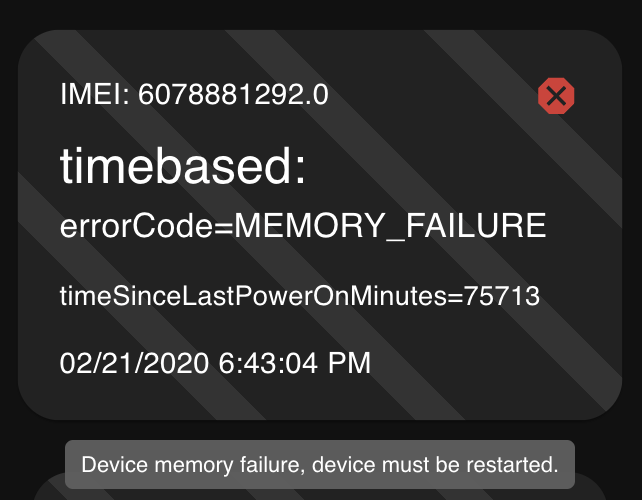

# Equipment Management System - Getting Started

This project aims to create a web app that lists equipments based on messages received from them. It uses [RabbitMQ](https://www.rabbitmq.com/) to handle the message queue.

Folders description:

 - api/ : The API consumer service that receives process and stores the messages on SQLite;
 - message-app/ : The ReactJS app that shows the list of equipment based on the filter and also generates a graph with poweron and poweroff equipment tags;
 - send-message-service/ : A producer service to test sending messages to the API;

Technologies chosen:

- fastify: fastify is one of the fastest web frameworks that provides a plugin architecture;
- amqplib (rabbitMQ library): this message broker was chosen because I needed a middleware specialized in storing, distributing and controlling the processing of messages in a fast and easy way;
- knex: query builder that simplifies back-end requests and database changes;
- sqlite3: simple and easy to start, use and manage sql database, I like to use it for small applications;
- mui: component library to make my development faster;
- vite: provides a dev server with rich feature enhancements over native ES modules, faster do develop;
- recharts: recommended react js library that generates charts;
- yarn: package manager safer, more reliable, and more efficient than npm;

## Running locally

First of all you need to start RabbitMQ service. See [RabbitDocs](https://www.rabbitmq.com/download.html) for more information:

```bash
docker run -it --rm --name rabbitmq -p 5672:5672 -p 15672:15672 rabbitmq:3.11-management
```

Run migrations and start the API:

```bash
cd api
yarn # install all app dependencies
yarn run-m # run migrations
yarn start
```

Start the ReactJS Front-end:

```bash
cd message-app
yarn # install all app dependencies
yarn start
```

Open [http://localhost:5173](http://localhost:5173) to view the front-end in the browser.

## Sending messages to API

Start the send-message-service:

```bash
cd send-message-service
yarn # install all app dependencies
yarn start
```

Use postman to POST more messages. Sample request:

```json
{
  "IMEI": "1231231213",
  "tag": "poweron",
  "value": "1",
  "timestamp": "2023-04-07T16:34:18-03:00"
}
```

# Screenshots

Screen to display all active equipment (equipment that reported data in the last 30 minutes);

 

</br>

Screen to display all equipment that is not reporting and with a status indicating the time that a certain equipment does not report data;
 - 24h without reporting (Warning) - Orange triangle;
 - more than 24h without reporting (Critical) - Red stop sign with an x;

 

</br>

Screen to display a graph showing all connected equipment and all disconnected equipment (equipment that sended poweroff as the last message)


</br>

The system must have a screen with suggestions of actions that the operator must perform when receiving equipment fault codes.


